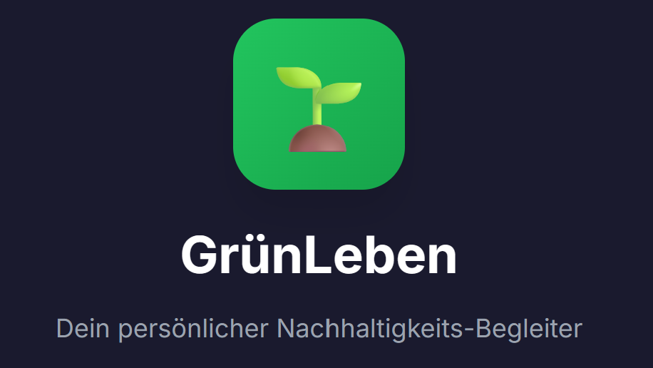
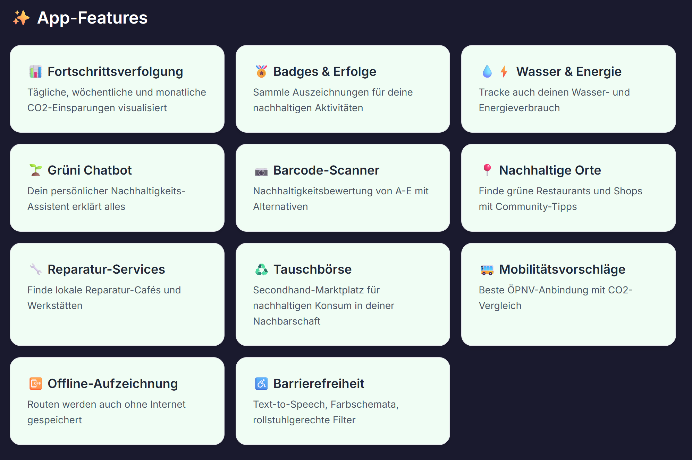

# GrünLeben – Frontend-Prototyp

GrünLeben ist ein Frontend-Prototyp einer Nachhaltigkeits-App, die Nutzer dabei unterstützt, im Alltag nachhaltiger zu leben.

## App-Features

## Vorschau/Anzeigen des Prototyps

1. **Repository klonen oder entpacken**
   - Lade das Repository herunter oder klone es auf deinen Rechner.

2. **Öffne den Projektordner**
   - Öffne den Ordner `GruenLeben` in deinem Dateimanager oder Editor.

3. **Starte die Vorschau im Browser**
   - Öffne die Datei `index.html` im Hauptverzeichnis mit einem Doppelklick oder Rechtsklick → "Im Browser öffnen".
   - Alternativ: Ziehe die Datei in ein Browserfenster.

4. **Navigation**
   - Die Startseite zeigt eine Übersicht aller Screens. Klicke auf die Vorschaubilder, um die einzelnen App-Seiten zu öffnen, wo Sie dort dann einfach zwischen den App-Seiten navigieren können.

### Hinweise
- Es ist keine Installation oder Build notwendig.
- Es wird kein Server benötigt – alles läuft lokal im Browser.
- Der Prototyp ist für die mobile Ansicht optimiert.

---

**Contributors:** An der Konzeption und Ausarbeitung der App-Features waren folgende Personen beteiligt:

- Angelika Köpplin
- Jennifer Ziep
- Joana Greinke
- Mika Malon Rüffert
- Moh'd Halhouli (Repository Owner & Maintainer)
